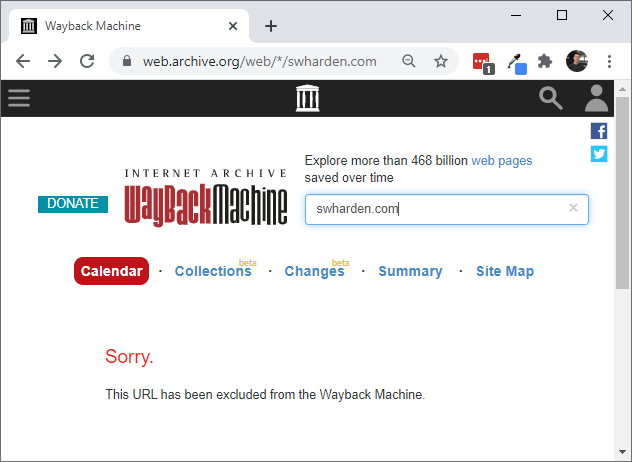

**This week my website was deleted from the Wayback Machine.** The [Wayback Machine](https://archive.org/web/) is an impressive website that lets you view what a website looked like years ago. As part of [Archive.org](https://archive.org/) Internet Archive, this website is truly impressive and holds entertainingly-old versions of most webpages. Just look at [Amazon.com in the year 2000](https://web.archive.org/web/20000601000000*/amazon.com) for a good laugh.

<div class='center border'>



</div>

**I started this blog as a child twenty years ago** and after seeing what the Wayback Machine pulled-up I realized that it may be best that the thoughts I had as a child stay in the past. I have personal copies of all my old blog posts, but I'd much prefer (with the wisdom of age and hindsight) that that material stay off the internet. I set-out to get my website removed from the Wayback Machine.

**For those of you wanting to do the same, this is how I did it:** I sent an email to `info@archive.org` stating the following:

```
Please remove my website [MY URL] from the Wayback Machine. [MY URL]/robots.txt has been updated to indicate I do not wish this website to be archived.

https://lookup.icann.org/ shows that [MY URL] points to [HOSTING COMPANY] nameservers, and I have attached a recent invoice from [HOSTING COMPANY] as evidence that I own this domain.

If additional evidence or action is required (e.g., DMCA takedown notice) please let me know.

Thank you!
```

**I'm not sure if editing `robots.txt` was necessary, but I felt it gave credence to the fact that I had control over the content of this domain.** That file contains the following text. In the past I read this was all it took to get your website de-listed from the wayback machine, but I added this same file to another domain name of mine and it has not been de-listed.

```
User-agent: archive.org_bot
Disallow: /

User-agent: ia_archiver
Disallow: /
```

**I attached an invoice** from the present year showing a credit card payment to my hosting company for the domain as a PDF. Interestingly I did not have to show a history of domain ownership. I downloaded the invoice from my hosting company's billing page that day, and it displays my home address but not my email address.

**Six days later, my site was removed.** This is the email I received:

```
FROM: Office Manager (Internet Archive)

Hello,

The following has now been submitted for exclusion from the Wayback Machine at web.archive.org: [MY SITE]

Please allow up to a day for the automated portions of the process to run their course and for the changes to take effect.

- The Internet Archive Team
```

**I reviewed a lot of websites** before reaching my strategy. I was surprised to see some people using issuing [DMCA takedown notices](https://www.dmca.com/faq/What-is-a-DMCA-Takedown) notices to Archive.org, and was happy to find this was not required in my case. Here are some of the resources I found helpful:

* [Archive.org forums](https://archive.org/iathreads/forums.php) - many recent discussions about how to have websites removed. Ironically posting on a public forum may draw _more_ attention to a sensitive website before it is shut down, so this doesn't seem like a great strategy. However, it does seem to work for some.

* [How to Block Your Website From The Wayback Machine](https://www.fightcyberstalking.org/how-to-block-your-website-from-the-wayback-machine/) - uses `robots.txt` which worked in ~2018 but is no longer sufficient.

* [3 Easy Steps To Removing Your Site From Archive.org Wayback Machine](https://blog.imincomelab.com/remove-site-wayback-machine-archive/) - suggests creating a `robots.txt`, issuing DMCA takedown notice, then sending email.

* [How to Delete Your Site from the Internet Archive](https://www.joshualowcock.com/tips-tricks/how-to-delete-your-site-from-the-internet-archive-wayback-machine-archive-org/) - suggests creating a `robots.txt`, issuing DMCA takedown notice, sending historical records of domain ownership, then sending email.

**If you have updated information** send me an email so I can update this page! In the mean time, I hope this information will be useful for others interested in curating their historical online presence.